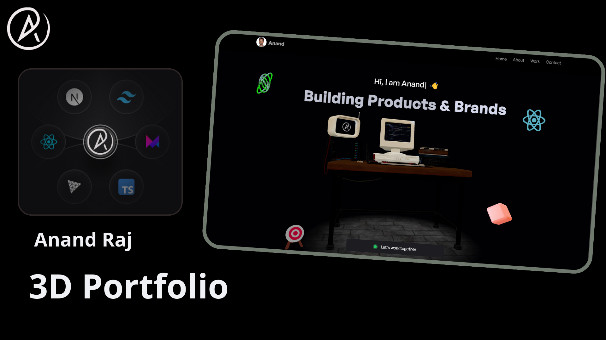

   
    
   

  

    
    
    
  

  <h3 align="center">My Developer Portfolio</h3>
  <a href="https://anand-raj.vercel.app/" target="_blank"><h2>anand-raj</h2></a>

## 📋 <a name="table">Table of Contents</a>

1. 🤖 [Introduction](#introduction)
2. ⚙️ [Tech Stack](#tech-stack)
3. 🔋 [Features](#features)
4. 🔗 [Links](#links)

## <a name="introduction">🤖 Introduction</a>

Built with React.js for handling the user interface, Three.js for rendering 3D elements, and styled with TailwindCSS, the 3D Minimalistic portfolio is a website project. The primary goal is to demonstrate the developer's skills in a unique manner that creates a lasting impact.

## <a name="tech-stack">⚙️ Tech Stack</a>

- Node.js
- React.js
- Three.js
- React Three Fiber
- React Three Drei
- Email JS
- Vite
- Tailwind CSS

## <a name="features">🔋 Features</a>

👉 **Immersive Hero**: An eye-catching 3D hacker room that responds to mouse movements, surrounded by animated mini-models.

👉 **Interactive About Me**: A sleek bento grid layout featuring personal info, a 3D globe pinpointing location, tech stack icons, and a one-click email copy option.

👉 **Dynamic Project Showcase**: Browse through projects while watching live demos inside a 3D computer model, seamlessly switching between different projects.

👉 **Engaging Experience Timeline**: Hover over career milestones to trigger interactive 3D animations that bring your professional journey to life.

👉 **Client Testimonials**: A dedicated section highlighting satisfied clients and their feedback.

👉 **Easy Contact Form**: A user-friendly email form for visitors to reach out directly from your portfolio.

👉 **Clean Footer**: A minimalist design featuring social media links for easy networking.

👉 **Fully Responsive**: Optimized layout ensuring a smooth experience across all devices, from desktop to mobile.

and many more, including code architecture and reusability 

## <a name="links">🔗 Links</a>

Here is the list of all the resources used in the project:

- [Hacker Room](https://sketchfab.com/3d-models/hacker-room-stylized-a0cfe6edf2dd494c8a95addf6bb13a10)
- [Computer](https://sketchfab.com/3d-models/3d-computer-sketchfab-weekly-11-mar23-d9931a9aba7c4ea1bc12b2a59dcef16e)
- [Target Model](https://vazxmixjsiawhamofees.supabase.co/storage/v1/object/public/models/target-stand/model.gltf)
- [React Logo](https://sketchfab.com/3d-models/react-logo-76174ceeba96487f9863f974636f641e)
- [gltfjsx](https://gltf.pmnd.rs/)
- [ReadyPlayerMe](https://readyplayer.me/)
- [Mixamo](https://www.mixamo.com/)
- [FBX Animations ZIP](https://drive.google.com/file/d/1yQhrRvEQFEwxbjG2qelv_T-gAatXJ3N1/view?usp=sharing)
